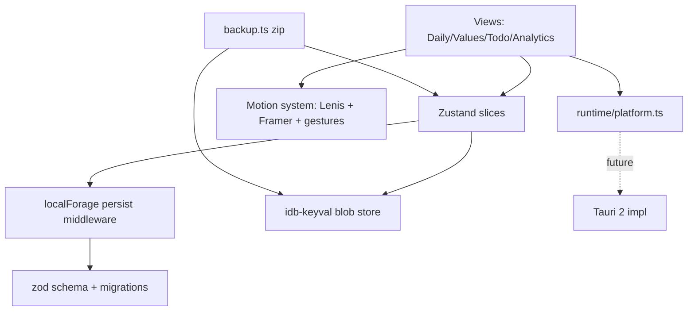

# Habit Tracker Frontend Implementation Plan

Greenfield project: only `plans/` and `.agents/skills/` exist today. This plan implements the union of [plans/initial-plan.md](plans/initial-plan.md), [plans/enhanced-plan.md](plans/enhanced-plan.md), and [plans/motion-plan.md](plans/motion-plan.md), reconciled against the project's [coding-guidelines skill](.agents/skills/coding-guidelines/SKILL.md). Nothing is deferred except Tauri native packaging.

## Conventions (from coding-guidelines, these override the plan docs)
- React 19 + React Compiler (mandatory, ESLint `react-compiler/react-compiler: error`), TypeScript `strict` + `noUncheckedIndexedAccess`.
- Feature-based folders (NOT type-based as in enhanced-plan). No code comments. Files <= 300 lines (350 hard max), functions <= 100, folders <= 11 files.
- Zustand split into per-domain slices with selectors + `useShallow`; localForage persistence. No `useEffect` data fetching.
- Framer Motion (`motion/react`) animates only `transform`/`opacity`, wrapped in `LazyMotion`; always respect `useReducedMotion()`.

## Architecture overview



## Proposed folder structure (feature-based)
```
src/
  app/                 App.tsx, AppShell, routes, providers (theme, motion, lenis)
  views/               DailyView/ ValuesView/ TodoView/ AnalyticsView/ (thin composition)
  features/
    habits/            HabitCard, HabitRow, CategorySection, TimeframeSection, image pipeline, gesture+edit hooks
    values/            ValueCard, NumericCounter, TextboxLog, link-sync logic
    todos/             TodoList, TodoItem, OverdueSection, swipe-to-complete
    analytics/         SummaryBanner, HistoryMatrix (virtualized), CompletionChart, scroll progress
    editmode/          EditModeBanner, dnd-kit sortable wrappers, radial menu
    backup/            BackupSettings, export/import zip pipeline, restore-mode dialog
    install/           InstallButton, useInstallPrompt, iOS instructions dialog
    settings/          SettingsSheet incl. Motion & Animation section
  common/
    components/ui/     shadcn components
    components/motion/ Reveal, Magnetic, Tilt, Spotlight, Ripple, CountUp, FlipDigits, Confetti, Celebration tiers
    hooks/             useResponsiveLayout, useGesture, useLenis, useScrollReveal, useHaptics, useMotionSettings
  store/               useAppStore + slices/ (habits, values, todos, history, settings, ui)
  storage/             localForageAdapter, imageStore, backup, keys, migrations/
  runtime/             platform.ts, fs.ts (browser impl now, Tauri later)
  lib/                 schema.ts (zod APP_DATA), date.ts, image.ts, sound.ts, constants.ts, motionTokens.ts
  styles/              globals.css, tailwind.css
```

## Implementation phases (see todos)

### Phase 1 - Scaffold & tooling
- Vite + React 19 + TS (strict) + Tailwind; React Compiler babel plugin; ESLint flat config + typescript-eslint; Vitest; Prettier.
- `shadcn init`; add Dialog, Sheet, DropdownMenu, Tooltip, Accordion, Tabs, Button, Input, Textarea, Switch, RadioGroup, Popover, Calendar, Card, Skeleton, Sonner, Badge, Alert, Separator.
- Latest npm versions per enhanced-plan.

### Phase 2 - Storage core (data safety first)
- `lib/schema.ts`: zod `APP_DATA` = `{ version, timeframes, categories, habits, values, todos, history, settings }`.
- `storage/keys.ts` frozen constants; `localForageAdapter.ts` (IndexedDB chain); Zustand `persist` adapter; `imageStore.ts` (idb-keyval blobs).
- `storage/migrations/`: ordered `vN->vN+1`, snapshot-before-migrate (`APP_DATA_PREMIGRATION_v{n}`), corruption isolation, 180-day history retention task on boot. Enforce all 8 data-safety rules from initial-plan: load-before-init, never overwrite, seed only when empty, merge-save.

### Phase 3 - Runtime abstraction
- `runtime/platform.ts` exposing `isTauri/isPWAInstalled/isIOS/isAndroid/saveFile/openFile/notify` with browser impl (File System Access API + Notification API). Views consume only `platform.*` so Tauri swap is the only future work.

### Phase 4 - App shell & navigation
- Header (view name, Edit Mode `Switch`, Backup dropdown, Install button); bottom nav (mobile/tablet) that becomes left sidebar at `>= lg` via `useResponsiveLayout`.
- Responsive breakpoints + card sizes per enhanced-plan table; `viewport-fit=cover`, `env(safe-area-inset-*)`, `visualViewport` keyboard avoidance, 44px `touch-target` utility.
- Animated active-tab pill via Framer `layoutId`.

### Phase 5 - Daily view
- Timeframe -> Category -> Habit horizontal `flex-row overflow-x-auto` rows with scroll-snap; fixed `aspect-square` `HabitCard` (2-line truncated title).
- `useGesture`: tap=done (green/check), long-press 500ms=missed (red/X), text-tap=detail `Sheet`, double-tap=done burst; conflict-free, disabled in Edit Mode.
- Image pipeline `lib/image.ts`: `createImageBitmap` -> resize 128x128 -> `toBlob('image/webp',0.85)` -> `imageStore` keyed by habit id -> blob URL.

### Phase 6 - Edit mode + dnd-kit
- `EditModeBanner`; dnd-kit `SortableContext` (horizontal habits, vertical categories), drag handles only in Edit Mode; add/rename/delete/upload; long-press radial menu (Rename/Replace/Delete). Hide all edit/backup controls when off.

### Phase 7 - Values view
- Numeric counter (`Input type=number` + large +/- buttons) and textbox log (`Textarea` in `Sheet`); daily reset, permanent history.
- Optional habit<->value linking: done triggers quick-input `Dialog`/active indicator; revert flips `syncedToday` only, never deletes history.

### Phase 8 - To-Do view
- `Accordion` Scheduled + Inbox sections; `Popover`+`Calendar` date picker; memoized `selectOverdueTodos` rolls incomplete past tasks into Today/Overdue (never hidden); completed stay completed; swipe-to-complete/delete with elastic resistance.

### Phase 9 - Analytics view
- Summary banner (Completion %, Done, Missed, Total) with CountUp; 180-day matrix virtualized via `@tanstack/react-virtual`, sticky first column, strict reverse-chronological, today-column pulse; text-log cells -> icon -> `Dialog`; Recharts minimalist `BarChart` with reveal-on-scroll bars; 30/90/180 toggle; pinch-to-zoom.

### Phase 10 - Backup & restore
- Export `.zip` (jszip): `manifest.json`, `data.json`, `images/<id>.webp`, `checksum.txt` (SHA-256); plus Lite JSON option. Save via `platform.saveFile`.
- Import `.zip`/`.json`: parse -> validate manifest (zod) -> verify checksum -> migrate -> restore-mode `RadioGroup` (Replace with typed confirm / Merge by `updatedAt`, never delete history) -> write blobs + commit in one transaction -> rollback + toast on failure.

### Phase 11 - PWA install (web app, not lightweight PWA)
- `vite-plugin-pwa` autoUpdate, Workbox precache shell/assets only (no user-data network caching); full manifest + icon set (192/512/maskable/apple-touch).
- `useInstallPrompt` + `InstallButton`: hide when standalone/iOS-home/Tauri; capture `beforeinstallprompt`; iOS Safari + desktop Safari/Firefox instruction dialogs; persist `settings.installedAt` on `appinstalled`.

### Phase 12 - Full motion & micro-interaction system (motion-plan, all items)
- Foundation: `motionTokens.ts`, Tailwind keyframes, `useMotionSettings` (Minimal/Standard/Playful + per-effect toggles + reduce-motion), Settings Motion section, `LazyMotion`.
- Lenis smooth scroll (single root instance) + `useScrollReveal` (IntersectionObserver, `once`); staggered reveals, parallax headers, sticky section progress, velocity skew, edge-glow/overscroll, scroll progress bar, scroll-snap rows, pull-to-refresh.
- Pointer effects (desktop bundle only, `matchMedia('(pointer:fine)')`): magnetic buttons, spotlight, 3D tilt, cursor companion, hover-reveal, gradient-border trace.
- Press/tap: ripple, spring press, `navigator.vibrate` haptics, double-tap burst, morphing check/X icons, color cross-fade, optimistic shimmer, loading button.
- Shared-element (`layoutId`) nav pill + sheet-from-card; View Transitions API route morphs; FLIP via `layout`.
- Number/text: CountUp, flip-clock streak, text scramble milestones, animated value diff.
- Idle/ambient: breathing glow on current timeframe, drifting empty-state gradients, floating illustrations, today-column pulse.
- Celebration tiers 1-4 (`canvas-confetti`) + gentle negative wiggle; opt-in Web Audio sound hooks (off by default).
- Performance/a11y: tier cost mobile vs desktop, pause on hidden tab, battery-saver downshift, `will-change` hygiene, transform-only (no CLS), text fallbacks for reduced motion, all gestures have button equivalents.

### Phase 13 - Quality pass & verification
- Themes (light/dark/system, persisted, view-transition cross-fade), Sonner toasts, Skeleton hydration loaders, reduced-motion audit.
- `tsc --noEmit`, ESLint (incl. react-compiler) zero warnings, Vitest unit tests for storage/migrations/selectors/backup, `vite build` + offline smoke test.

## Notes / decisions
- Reconciled enhanced-plan's type-based folders to the skill's feature-based structure; dropped "well-commented" in favor of self-documenting code.
- PWA install + service worker are included (shell-only caching) and are not the same as the forbidden "lightweight browser-only PWA experience".
- Only deferred item: Tauri 2 native impl behind `runtime/platform.ts` + `fs.ts` (browser impls fully built now).